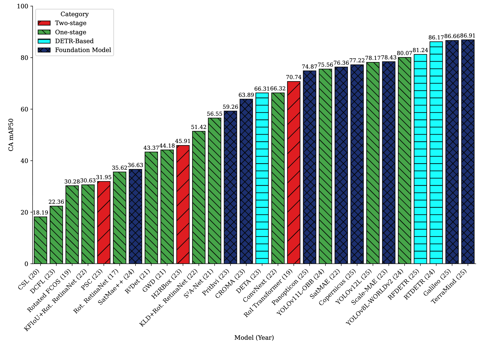
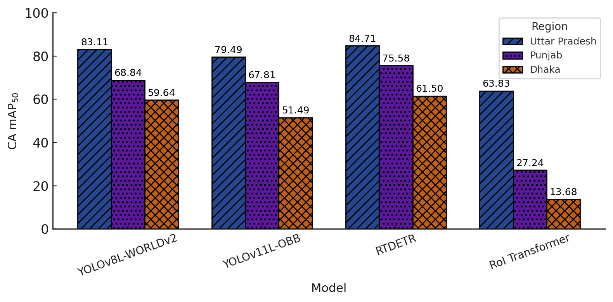
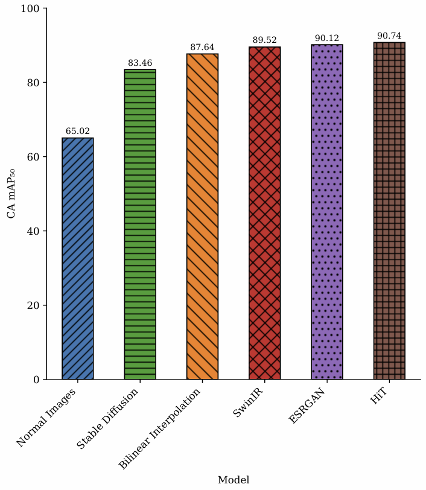

::: {.container}

## Benchmarking Overview

We evaluated **28 state-of-the-art object detection models** across four challenging evaluation scenarios to assess the utility of SentinelKilnDB for real-world deployment.

## Evaluation Tasks

### T1: In-Region Detection
Standard evaluation where models are tested on regions included in the training distribution.

### T2: Out-of-Region Generalization  
Geographic domain adaptation test where models trained on one region are evaluated on geographically distant regions.

### T3: Temporal Generalization
Leave-one-season-out (LOSO) evaluation using data from Winter (W), Pre-Monsoon (PM), Monsoon (M), and Post-Monsoon (PoM).

### T4: Super-Resolution Enhancement
Evaluation of detection performance on enhanced-resolution imagery using various super-resolution techniques.

## Key Results

### In-Region Performance Comparison

### Complete Model Performance (Top 15 Models)
**⇄ Scroll for more columns**

::: {.table-container}
| Rank | Category    | Method              | Publication | Backbone | BBox | CA mAP₅₀  | CFCBK     | FCBK      | Zigzag    |
| ---- | ----------- | ------------------- | ----------- | -------- | ---- | --------- | --------- | --------- | --------- |
| 1    | Foundation  | **TerraMind**       | ICCV-25     | ViT-B    | AA   | **86.91** | 69.04     | **70.54** | **75.55** |
| 2    | Foundation  | **Galileo**         | ICML-25     | ViT-B    | AA   | **86.66** | **72.02** | 69.81     | 72.19     |
| 3    | Transformer | **RTDETR**          | CVPR-24     | Res101   | AA   | **86.17** | 58.38     | 62.46     | 61.34     |
| 4    | Transformer | **RFDETR**          | arXiv-25    | Dinov2   | AA   | 81.24     | 63.07     | 59.19     | 65.78     |
| 5    | One-stage   | **YOLOv8L-WORLDv2** | CVPR-24     | CSPDr53  | AA   | 80.07     | 55.28     | 60.81     | 54.26     |
| 6    | Foundation  | **Scale-MAE**       | ICCV-23     | ViT-L    | AA   | 78.43     | 52.10     | 60.77     | 65.18     |
| 7    | One-stage   | **YOLOv12L**        | arXiv-25    | CSPDr53  | AA   | 78.17     | 52.05     | 56.52     | 47.62     |
| 8    | Foundation  | **CopernicusFM**    | ICCV-25     | ViT-B    | AA   | 77.22     | 61.09     | 59.73     | 67.78     |
| 9    | Foundation  | **SatMAE**          | NeurIPS-22  | ViT-L    | AA   | 76.36     | 40.65     | 50.72     | 56.03     |
| 10   | One-stage   | **YOLOv11L-OBB**    | arXiv-24    | CSPDr53  | OBB  | 75.56     | 59.19     | 56.87     | 50.91     |
| 11   | Foundation  | **Panopticon**      | CVPR-25     | ViT-B    | AA   | 74.87     | 43.13     | 50.61     | 55.11     |
| 12   | Two-stage   | **RoI Transformer** | CVPR-19     | Swin-T   | OBB  | 70.74     | 40.45     | 51.84     | 55.23     |
| 13   | One-stage   | **ConvNext**        | CVPR-22     | Res50    | OBB  | 66.32     | 28.11     | 41.10     | 46.12     |
| 14   | Transformer | **DETA**            | ICCV-23     | Res50    | AA   | 66.31     | 44.76     | 49.56     | 61.21     |
| 15   | Foundation  | **CROMA**           | NeurIPS-23  | ViT-B    | AA   | 63.89     | 17.69     | 44.66     | 56.40     |
:::

### Out-of-Region Generalization

### Spatial and Temporal Performance Summary

::: {.table-container}
| Model | Uttar Pradesh | Dhaka | Punjab | LOCO (I+B+P→A) | Seasonal (W→PM) |
|-------|---------------|-------|--------|-----------------|------------------|
| **YOLOv8L-WORLDv2** | **83.11** | **59.64** | **68.84** | 46.34 | 55.56 |
| **YOLOv11L-OBB** | 79.49 | 51.49 | 67.81 | 75.02 | 60.21 |
| **RT-DETR** | 84.71 | 61.50 | 75.58 | 49.89 | 58.43 |
| ConvNeXt | 51.01 | 7.07 | 16.73 | 35.22 | 42.15 |
| RoI Transformer | 63.83 | 13.68 | 27.24 | 41.67 | 48.91 |
:::

::: {.key-findings}
- Significant performance drop when transferring across regions (15-25% mAP decrease)
- YOLOv11L-OBB maintains best overall cross-region performance
- Geographic domain shift presents major challenge for deployment
:::

### Super-Resolution Enhancement Results

::: {.table-container}
| Method | Resolution | CA mAP₅₀ | CFCBK | FCBK | Zigzag | PSNR | SSIM |
|--------|------------|----------|-------|------|--------|------|------|
| Original | 128×128 | 65.02 | 0.00 | 0.00 | 63.18 | - | - |
| Bilinear | 512×512 | 87.64 | 22.77 | 34.00 | 86.11 | - | - |
| Stable Diffusion | 512×512 | 83.46 | 38.50 | 27.04 | 79.60 | 26.71 | 0.6785 |
| SwinIR | 512×512 | 89.52 | 37.01 | 48.11 | 86.54 | 27.14 | 0.7780 |
| ESRGAN | 512×512 | 90.12 | 47.43 | 42.89 | 87.35 | 27.16 | 0.5678 |
| **HiT-SR** | 512×512 | **90.74** | **53.79** | **53.88** | **88.28** | **34.44** | **0.9168** |
:::

::: {.results-highlight}
- Super-resolution provides substantial improvements (25+ mAP points)
- HiT-SR achieves best detection performance with highest image quality
- Even simple bilinear interpolation provides significant gains
:::

## Dataset Comparison

::: {.table-container}
| Dataset | Imagery | Classes | Images | Instances | GSD | Public |
|---------|---------|---------|---------|-----------|-----|---------|
| VEDAI | Aerial | 9 | 1,210 | 3,640 | 0.125m | ✅ |
| HRSC2016 | Google Earth | 25 | 1,070 | 2,976 | 0.4-2m | ✅ |
| DOTA-V1.0 | Google Earth | 15 | 2,806 | 188,282 | 0.1-4.5m | ✅ |
| DIOR-R | Google Earth | 20 | 23,463 | 192,518 | 0.5-1m | ✅ |
| **SentinelKilnDB** | **Sentinel-2** | **3** | **78,694** | **105,933** | **10m** | **✅** |
:::

## Performance Analysis

### Detection Challenges
- **Small Object Size**: Kilns span ~30 pixels in 10m resolution imagery
- **Low Contrast**: Similar appearance to surrounding terrain  
- **Geometric Variation**: Different kiln orientations and shapes
- **Seasonal Changes**: Appearance varies across seasons

### Model Insights
- **Foundation Models**: Show promise but need specialized training for satellite imagery
- **OBB vs AA**: Oriented bounding boxes provide better spatial accuracy for irregular shapes
- **Multi-Scale Features**: Essential for detecting small objects in low-resolution imagery
- **Data Augmentation**: Critical for robust cross-region performance

### Training Configuration
- **Batch Size**: 16 (optimized for GPU memory)
- **Learning Rate**: 1e-4 with cosine scheduling
- **Epochs**: 100 with early stopping
- **Augmentation**: Mosaic, mixup, rotation, scaling
- **Hardware**: NVIDIA A100 GPUs

## Code and Models

All benchmarking code, trained models, and evaluation scripts are publicly available:

::: {.btn-group}
[Benchmark Code](https://github.com/rishabh-mondal/NeurIPS_2025){.btn}
[Pretrained Models](https://github.com/rishabh-mondal/NeurIPS_2025/releases){.btn}
:::

:::
